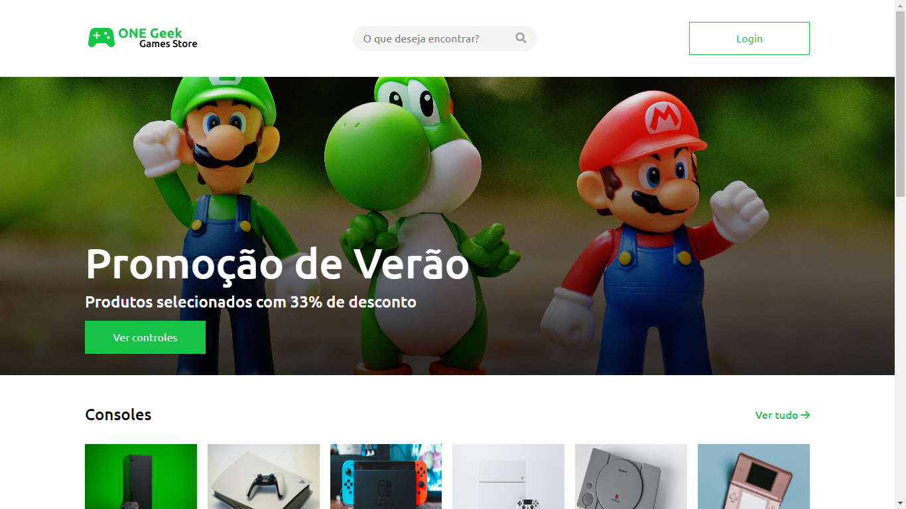
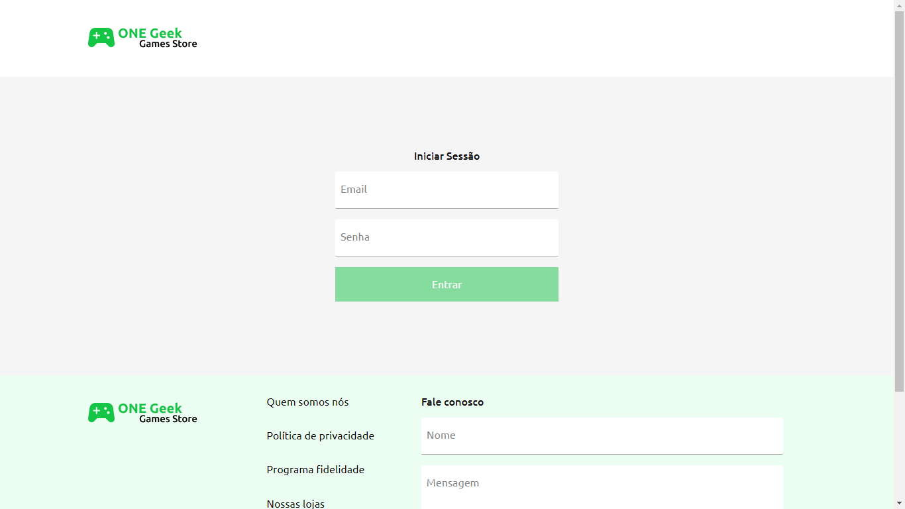
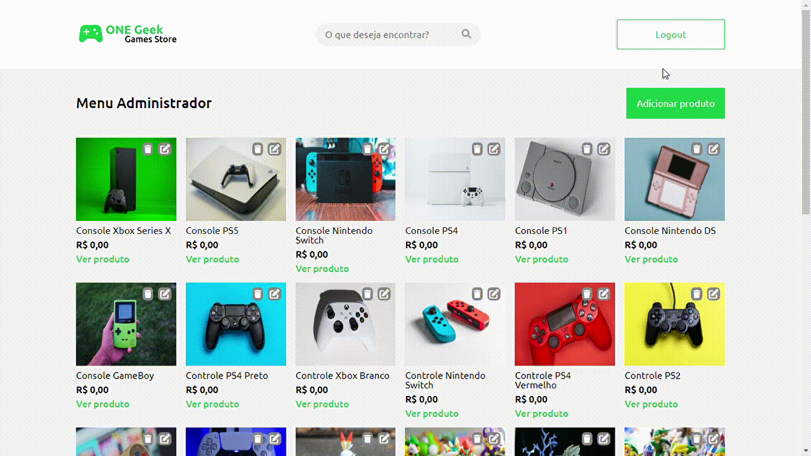
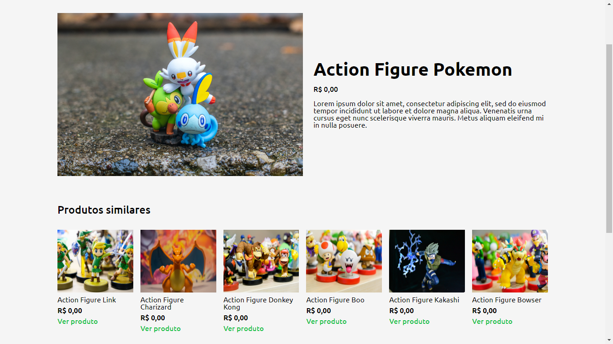
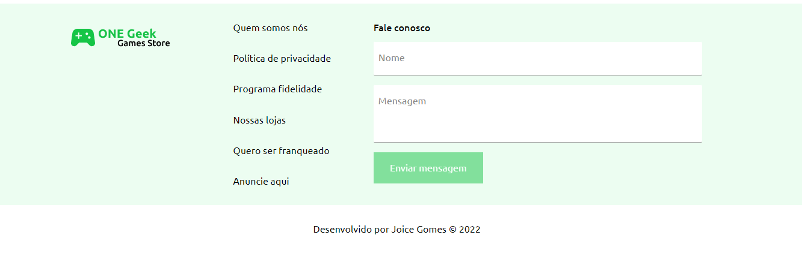

 <h1 align="center">   
   One Geek Games Store | Site E-commerce
 </h1>

## Índice
* [Descrição do Projeto](#descrição-do-projeto)
* [Conteúdo do site](#contéudo-do-site)
* [Como acessar e utilizar o site](#como-acessar-e-utilizar-o-site)

 

## Descrição do Projeto
Projeto desenvolvido para o desafio do programa Oracle Next Education. O desafio consiste em desenvolver o FrontEnd de um site E-commerce fictício. Para isso, utilizei:
1. HTML, CSS e JavaScript, 
2. operações **CRUD** com **fetch API**, 
3. **JSON-server** para mockar uma REST API,
4. **validações de dados de formulários**.

 

## Contéudo do site:
> 🟡 Página inicial (index) com ferramenta de busca para os produtos oferecidos, link para login como admin, banner com informações relevantes do momento, galeria com informações dos produtos (imagem, nome, preço, link para página do produto):
>> 

 

> 🟡 Página para iniciar sessão (login) e ser redirecionado para o menu administrador:
>> 

 

> 🟡 Menu administrador, onde pode-se adicionar, editar e remover produtos (CRUD):
>> 

 

> 🟡 Página do produto individual com todas as suas informações mais a seção de produtos similares:
>> 

 

> 🟡 Todas as páginas possuem um rodapé com um formúlario para contato e outros links úteis:
>> 

 

> 🟡 Responsividade para várias resoluções de telas:
>> 

## Como acessar e utilizar o site

Você pode acessar o site clicando [aqui](https://joi-gn.github.io/one-geek-games-store/), porém por o projeto não ter a parte back-end desenvolvida, as funcionalidades do CRUD não funcionam sem utilizar o JSON Server ou outra forma de imitar uma REST API.  
Para a demo do site utilizei o My JSON Server que cria um servidor online e por isso as operações CRUD feitas são falsas e não são mantidas.  
Se você quiser checar o site com todas as funcionalidades, siga os passos abaixo:

1. Baixe o repositório;
2. Utilizando um editor de texto ou de código, altere o valor da constante `DATABASE_URL` para `http://localhost:3000/products` no arquivo [product-service.js](assets/js/service/product-service.js);
3. Instale o JSON SERVER [(link do repositório e instruções aqui)](https://github.com/typicode/json-server), após a instalação, inicie o servidor na pasta principal do projeto;
4. Utilize Live Server, Http Server ou alguma outra ferramenta para hospedar as páginas HTML.